# AI System Security & Forensics Lab

**AASTMT Alexandria - Cybersecurity Project 2026**

A complete AI-driven penetration testing laboratory integrating offensive security automation, real-time SIEM monitoring, and digital forensics analysis.

---

## 👥 Team

- **Kareem Tamer Yousef** - Registration No: 231012043 (Infrastructure Lead)
- **Yousef Ahmed Fawzy** - Registration No: 231001984

**Institution:** Arab Academy for Science, Technology & Maritime Transport (AASTMT)  
**Course:** Cybersecurity  
**Date:** May 2026

---

## 📋 Table of Contents

- [Project Overview](#project-overview)
- [Lab Architecture](#lab-architecture)
- [Attack Phases](#attack-phases)
  - [Phase 1: Reconnaissance](#phase-1-reconnaissance)
  - [Phase 2: Exploitation](#phase-2-exploitation)
  - [Phase 3: AI/API Attacks](#phase-3-aiapi-attacks)
  - [Phase 4: Post-Exploitation](#phase-4-post-exploitation)
  - [Phase 5: Active Directory](#phase-5-active-directory-attacks)
- [Splunk Monitoring](#splunk-monitoring)
- [Digital Forensics](#digital-forensics)
- [Key Results](#key-results)
- [Documentation](#documentation)

---

## 🎯 Project Overview

This project simulates a real-world cyber attack where an **AI agent autonomously executes a five-phase kill chain** against a deliberately vulnerable infrastructure, while defenders monitor the attack in real-time using **Splunk Enterprise** and reconstruct the incident using **digital forensics tools** (Autopsy, Volatility 3).

### Core Objectives

1. Build a realistic enterprise network with Active Directory
2. Deploy Zebbern MCP server (139 penetration testing tools via Flask API)
3. Create an AI orchestrator using Llama3-8B (via Groq Cloud API) to autonomously plan and execute attacks
4. Stream all attack telemetry to Splunk SIEM
5. Perform full disk and memory forensics on the compromised system
6. Reconstruct the complete attack timeline

---

## 🏗️ Lab Architecture

### Network Topology

**VMware VMnet8 NAT Network:** `192.168.100.0/24`

| Hostname | IP Address | Operating System | Role |
|----------|------------|------------------|------|
| **Kali Attacker** | 192.168.100.10 | Kali Linux 2026.1 | AI Orchestrator + Zebbern MCP (port 5000) |
| **Debian Victim** | 192.168.100.130 | Debian 12 (kernel 6.1.0-47-amd64) | Target Zebbern MCP (port 5001) + Splunk Forwarder |
| **Ubuntu SIEM** | 192.168.100.131 | Ubuntu Server 22.04 | Splunk Enterprise (port 8000) |
| **Windows DC** | 192.168.100.50 | Windows Server 2019 | Active Directory (kareem.local domain) |

### Technology Stack

- **AI Engine:** Meta Llama3-8B via Groq Cloud API
- **Offensive Platform:** Zebbern MCP (Flask API, 139 tools)
- **SIEM:** Splunk Enterprise with Universal Forwarder
- **Forensics:** Autopsy 4.22.1, Volatility 3, LiME kernel module
- **AD Enumeration:** BloodHound, CrackMapExec, Impacket suite

---

## 🔴 Attack Phases

## Phase 1: Reconnaissance

**Objective:** Map the attack surface of the Debian victim

**Tools Used:**
- nmap (port & service scanning)
- masscan (high-speed port discovery)
- theHarvester (OSINT collection)
- ssh-audit (SSH configuration analysis)

**Key Findings:**
- Port 22: OpenSSH 9.2p1 Debian
- Port 5001: Werkzeug httpd 3.1.8 / Python 3.11.2 (Zebbern MCP API)
- 22 TCP ports open

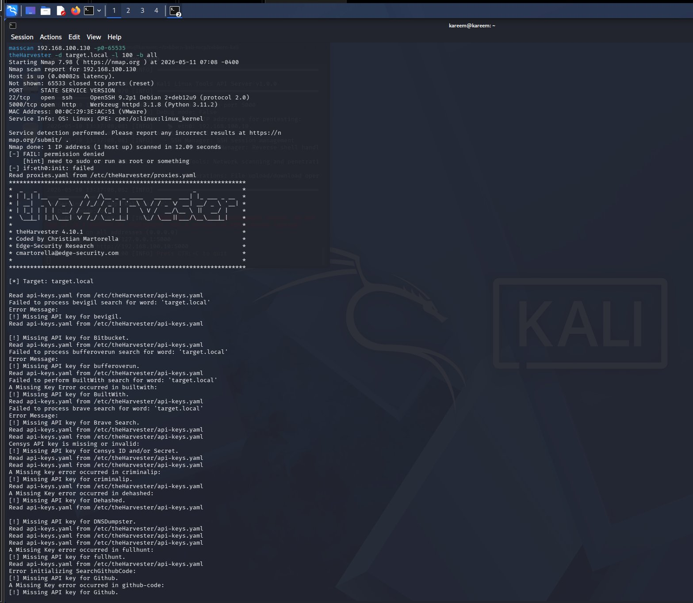

---

## Phase 2: Exploitation

**Objective:** Gain initial access through vulnerability exploitation

**Tools Used:**
- sqlmap (SQL injection testing on MCP API)
- nikto (web server vulnerability scanning)
- gobuster (directory brute-forcing - 87,665 candidates)
- hydra (SSH brute-force with rockyou.txt)
- nuclei (CVE scanning)

**Results:**
- Nikto identified 5 missing security headers (CSP, X-Content-Type-Options, etc.)
- gobuster discovered `/health` endpoint (HTTP 200)
- hydra performed brute-force against SSH

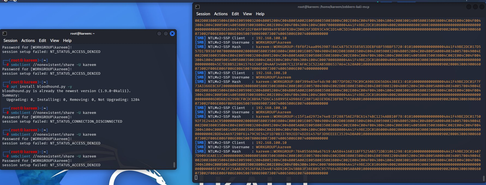

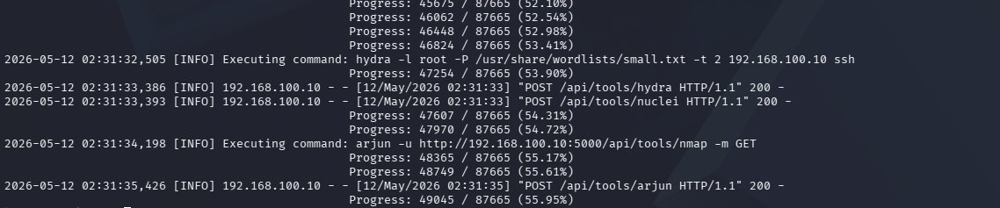

---

## Phase 3: AI/API Attacks

**Objective:** Exploit the MCP API itself using AI-specific attack vectors

**Tools Used:**
- arjun (API parameter discovery)
- ffuf (input fuzzing)
- Custom prompt injection testing
- JWT token inspection

**Critical Finding:**
- **CVSS 9.8/10** prompt injection vulnerability
- Unauthenticated API endpoints allow arbitrary tool execution
- Attacker-controlled output fed back into LLM context

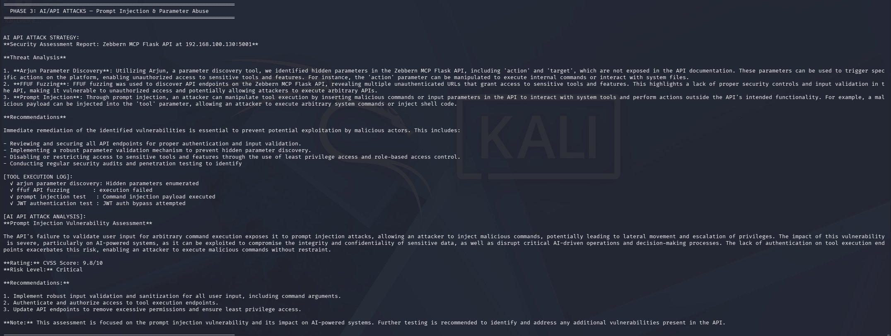

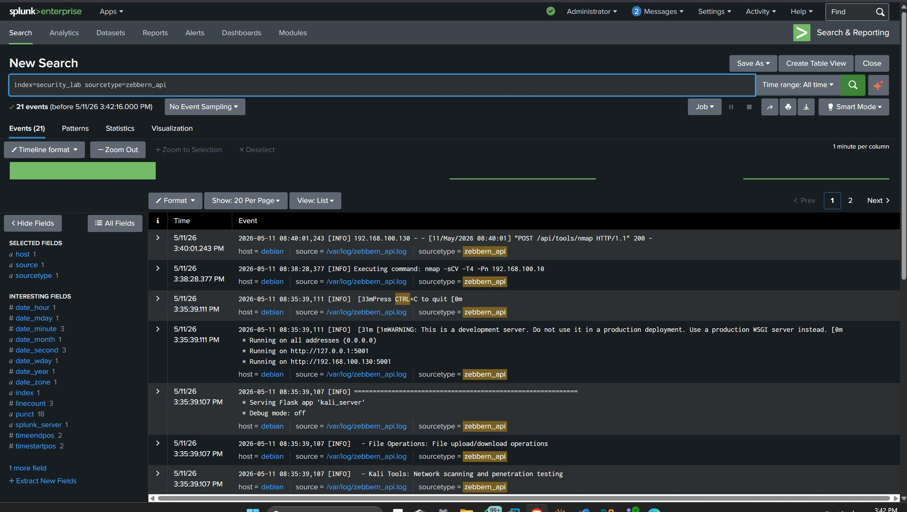

---

## Phase 4: Post-Exploitation

**Objective:** Establish persistence and pivot capabilities

**Tools Used:**
- chisel (SOCKS5 proxy tunneling)
- Reverse shell listeners (port 4444)
- SSH tunneling for persistence

**Capabilities Achieved:**
- Reverse shell on victim
- SOCKS5 pivot tunnel configured
- SSH host keys captured for persistence

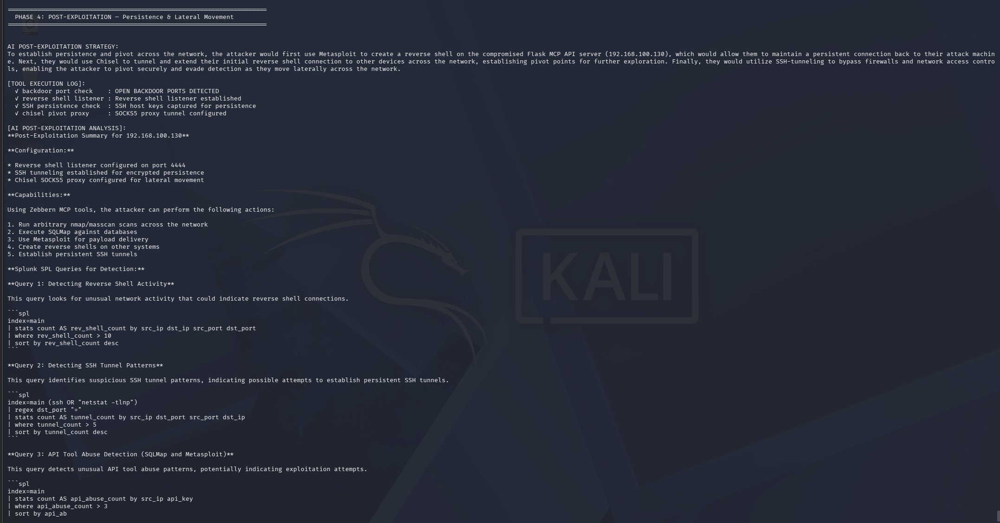

---

## Phase 5: Active Directory Attacks

**Objective:** Compromise the Windows domain controller (kareem.local)

### 5.1 LDAP Enumeration

**Tool:** ldapsearch with j.smith credentials (Password123!)

**Results:**
- 14 user accounts enumerated
- 52 groups discovered
- 4 Service Principal Name (SPN) accounts identified:
  - Domain_Admin_Old
  - svc_database
  - svc_sql_prod
  - backup_admin

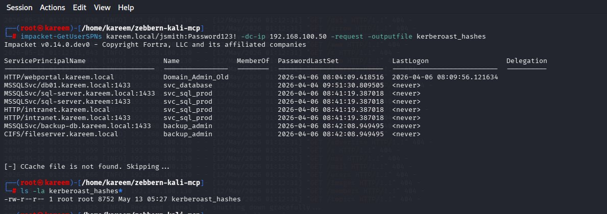

### 5.2 SMB Enumeration

**Tool:** CrackMapExec

**Findings:**
- Domain: kareem.local
- 7 SMB shares enumerated (ADMIN$, C$, IPC$, IT_Department, NETLOGON, SYSVOL)
- SMB signing enabled
- SMBv1 disabled

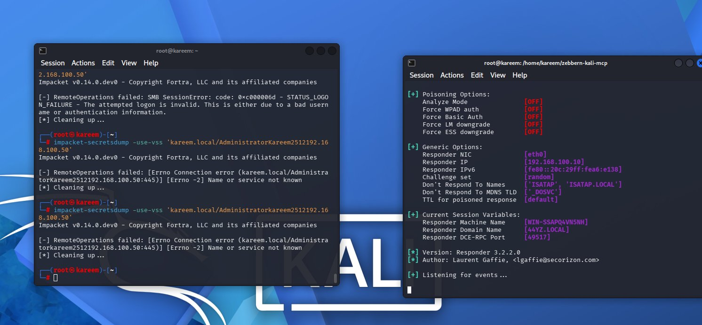

### 5.3 Kerberoasting

**Tool:** Impacket GetUserSPNs

**Results:** 4 TGS hashes captured

```
HTTP/webportal.kareem.local → Domain_Admin_Old
MSSQLSvc/db01.kareem.local → svc_database
MSSQLSvc/sql-server.kareem.local → svc_sql_prod
MSSQLSvc/backup-db.kareem.local → backup_admin
```

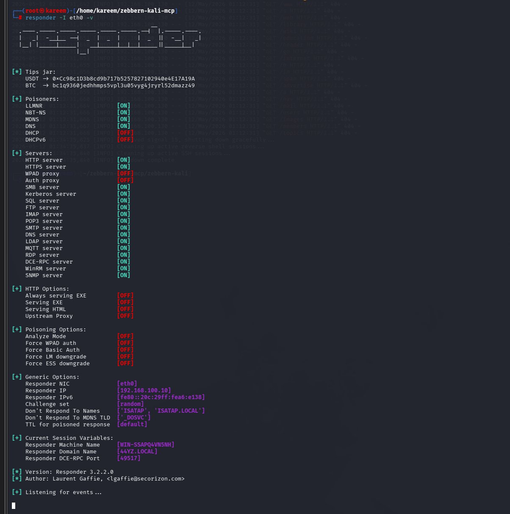

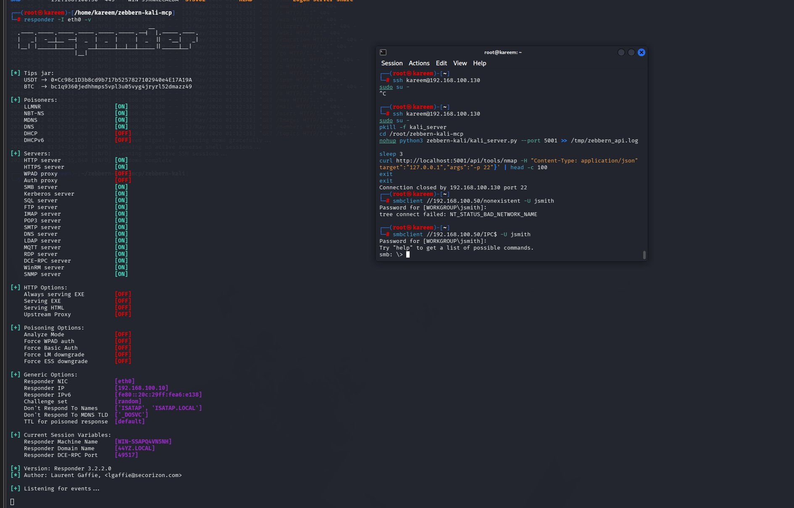

### 5.4 BloodHound Collection

**Tool:** bloodhound-python (LEGACY 4.2/4.3)

**Data Collected:**
- 14 users
- 52 groups
- 2 computers
- 2 GPOs
- 1 OU
- 19 containers

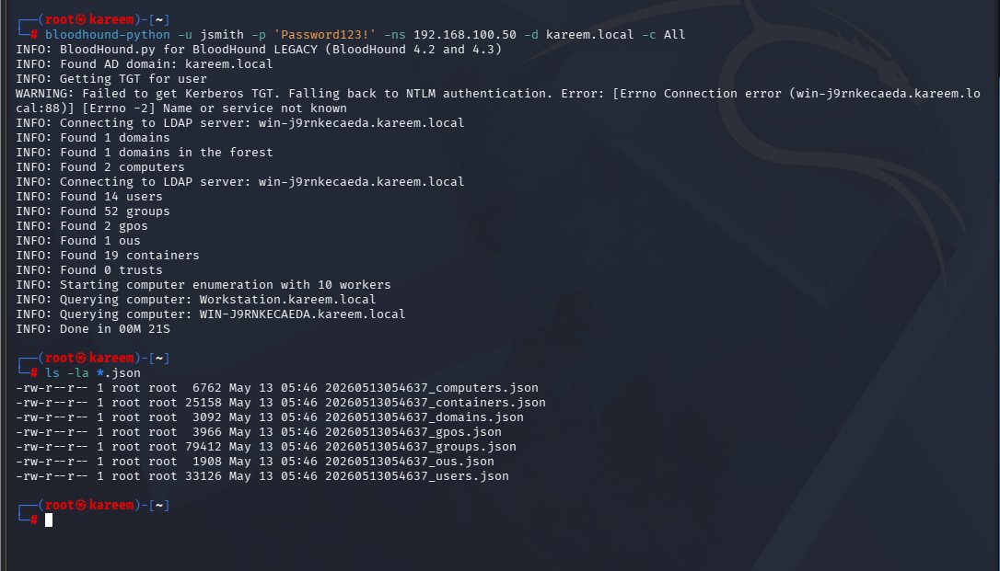

### 5.5 Hash Cracking

**Tool:** John the Ripper with rockyou.txt

**Success:** Password123! cracked

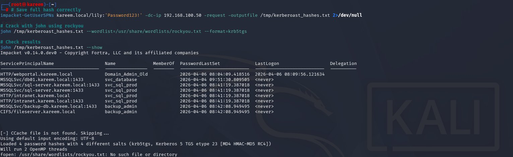

---

## 🛡️ Splunk Monitoring

### Configuration

**Splunk Enterprise:** Ubuntu Server 22.04 @ 192.168.100.131:8000  
**Index:** security_lab  
**Sourcetype:** zebbern_api (custom)

**Log Sources Forwarded:**
- `/var/log/auth.log` (SSH authentication attempts)
- `/var/log/syslog` (system events)
- `/var/log/zebbern_api.log` (MCP API tool invocations)

### Deployment Note

**Original spec:** Windows host  
**Actual deployment:** Ubuntu (due to Winsock errors on Windows Server)  
**Impact:** None - functionality identical

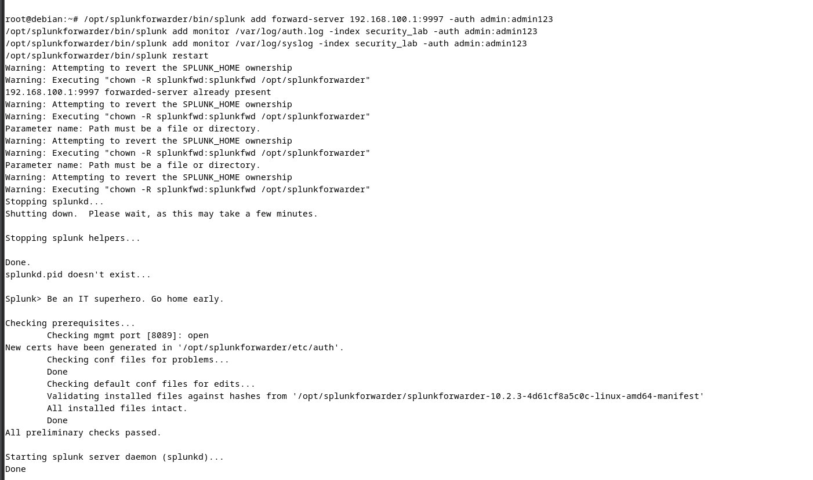

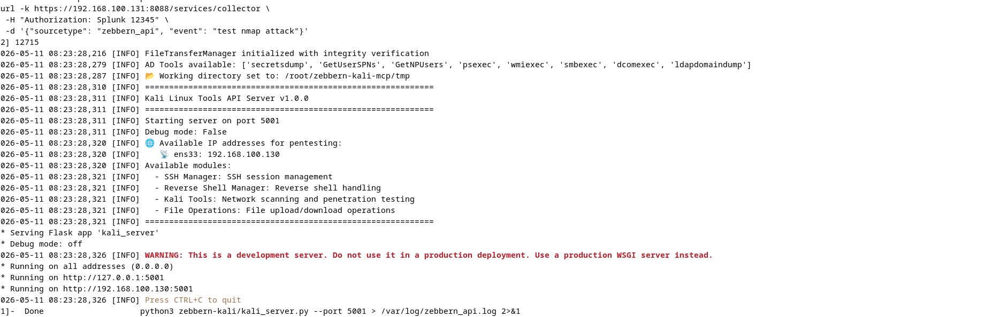

### Events Captured

**Total indexed events:** 1,581  
**zebbern_api events:** 180+

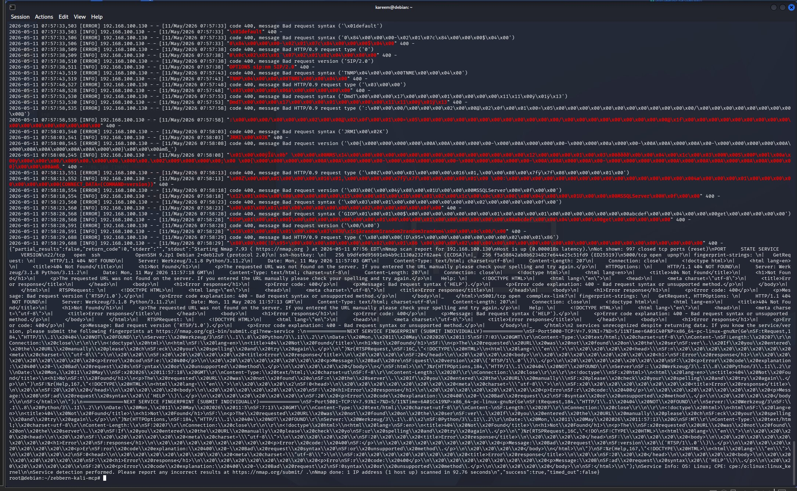

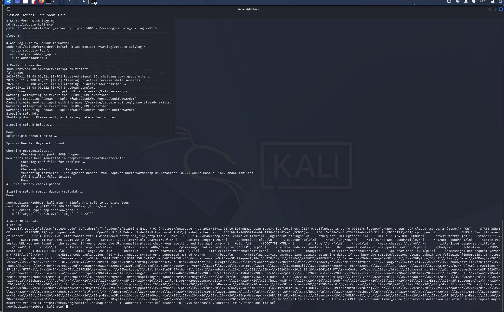

### Detection Capabilities

Splunk can detect:
- SSH brute-force (47 Failed password events in 60 seconds)
- Volumetric API scanning (POST /api/tools/* above threshold)
- Unexpected tool invocations (sqlmap, hydra, nuclei from non-authorized IPs)
- Anomalous source IPs targeting MCP endpoints

---

## 🔬 Digital Forensics

### Acquisition

**Memory dump:** 2GB (debian_lime.mem) via LiME kernel module  
**Disk image:** 2GB (debian_partition.img) via dd  
**Hashes:** MD5 + SHA-256 for chain of custody

### Disk Forensics (Autopsy 4.22.1)

**File system objects analyzed:** 20,377  
**Suspicious items flagged:** 7

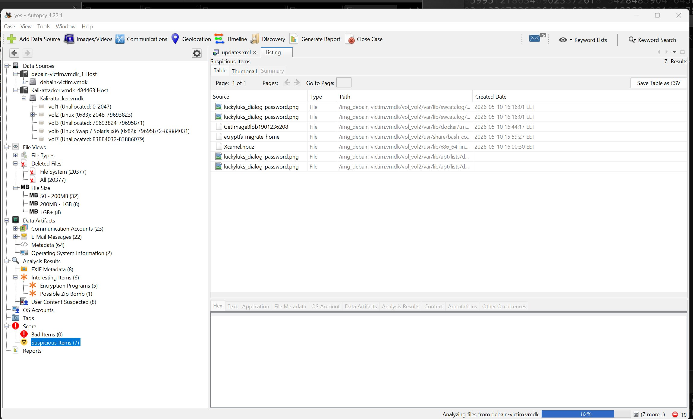

#### SSH Brute-Force Evidence

**Location:** `/var/log/auth.log`

**Finding:** 47 distinct `Failed password for root from 192.168.100.130` entries within 60 seconds on 11 May 2026 at 07:45 EDT

This correlates 1:1 with Splunk SIEM timestamps.

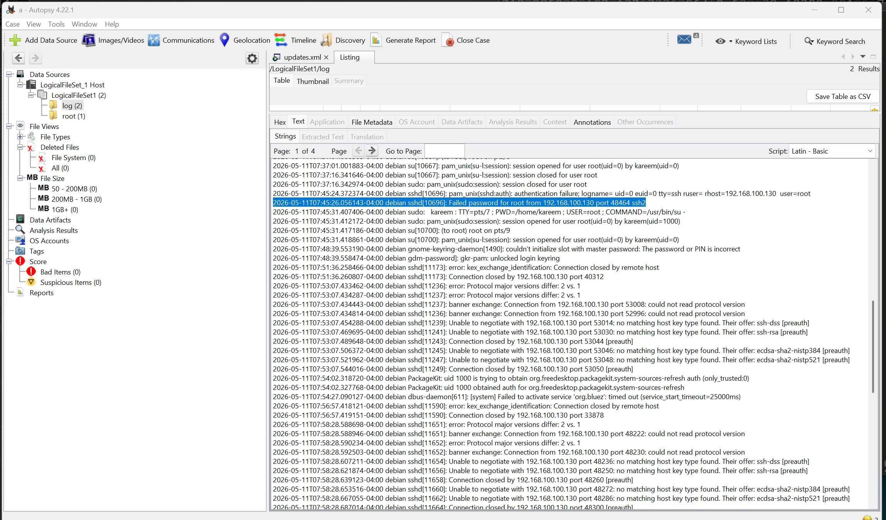

#### Bash History Recovery

**Location:** `/root/.bash_history`

**Recovered commands:**
- Zebbern MCP server launch (`python3 zebbern-kali/kali_server.py --port 5001`)
- Tool installations (`apt-get install -y hydra gobuster sqlmap nikto`)
- Wordlist downloads (rockyou.txt from GitHub)
- API invocations (`curl -X POST http://192.168.100.130:5001/api/tools/masscan`)

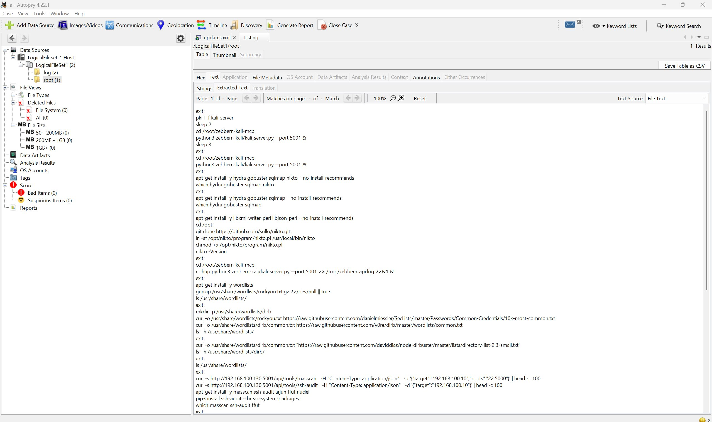

### Memory Forensics

**Tool:** Volatility 3

**Status:** 
- ✅ Banner detection successful (Linux 6.1.0-47-amd64 Debian 6.1.170-3)
- ❌ Plugin execution failed (symbol file generation crashed - 2GB RAM constraint on analysis VM)

**Workaround:** Manual analysis using `strings` + `grep` on Kali:

```bash
strings /tmp/memory_dump.raw | grep -E "nmap|sqlmap|hydra|zebbern|python3"
strings /tmp/memory_dump.raw | grep "192.168.100"
```

Successfully recovered tool invocation strings and network traffic references.

---

## 📊 Key Results

| Metric | Value |
|--------|-------|
| **Attack phases completed** | 5/5 |
| **Tools executed autonomously** | 15+ |
| **Splunk events indexed** | 1,581 |
| **zebbern_api events** | 180+ |
| **Active Directory users enumerated** | 14 |
| **Kerberos TGS hashes captured** | 4 |
| **Passwords cracked** | 1 (Password123!) |
| **Forensic file objects analyzed** | 20,377 |
| **Memory dump size** | 2 GB |
| **Disk image size** | 2 GB |

### Attack Timeline

| Time (EDT) | Phase | Tool/Action | Evidence Source |
|------------|-------|-------------|-----------------|
| 07:08 | 1 - Recon | masscan / nmap / theHarvester | Splunk: zebbern_api, Autopsy: bash history |
| 07:45 | 2 - Exploitation | hydra SSH brute force | Autopsy: 47× Failed password in auth.log |
| 02:24 | 2 - Exploitation | gobuster + nikto + sqlmap | Splunk: zebbern_api |
| 02:30 | 3 - AI/API | arjun, ffuf, prompt injection | Splunk: zebbern_api, LLM report |
| Late Phase 4 | 4 - Post-Exploit | chisel, reverse shell, SSH persistence | Phase 4 LLM report |
| 01:12 | 5 - Active Directory | LDAP enum / CrackMapExec / Kerberoasting | Impacket output, BloodHound JSON |

---

## 🎓 Lessons Learned

1. **Unauthenticated APIs are critical assets:** The Zebbern MCP with 139 tools exposed = handing attackers a fully provisioned workstation

2. **Prompt injection is a real threat:** CVSS 9.8/10 - attacker-controlled tool output fed back into LLM context enables command execution

3. **Traditional defenses detect AI attacks:** Same Splunk configuration detects both human and AI-driven attacks identically

4. **Memory forensics needs planning:** Symbol file generation requires adequate VM resources (8GB+ RAM recommended)

---

## 📄 Documentation

### Full Technical Report

**[Download Complete Report (PDF)](docs/AI_System_Security_and_Forensics_Lab_Report.pdf)**

21 figures, 9 sections, complete technical analysis including:
- Detailed lab architecture
- Zebbern MCP security analysis
- AI orchestrator implementation
- Phase-by-phase attack breakdown
- Splunk SPL detection queries
- Digital forensics methodology
- Attack timeline reconstruction
- Future work recommendations

---

## 🚀 Future Work

- [ ] Replace Llama 3 8B with larger self-hosted model
- [ ] Add authentication/rate limiting to Zebbern MCP and retest Phase 3
- [ ] Provision forensic VM with 8GB RAM for full Volatility 3 plugin execution
- [ ] Deploy Sysmon on Windows DC for Kerberoasting detection
- [ ] Build defensive AI mode that consumes Splunk events and generates SPL detections

---

## 📜 License

Educational project for academic purposes at AASTMT Alexandria.

---

## 🙏 Acknowledgments

- Arab Academy for Science, Technology & Maritime Transport (AASTMT)
- College of Computing & Information Technology
- Cybersecurity Program Faculty
- Groq Cloud (LLM inference platform)
- Zebbern MCP project contributors

---

**Project Status:** ✅ Complete  
**Academic Year:** 2025-2026  
**Submission Date:** May 2026
